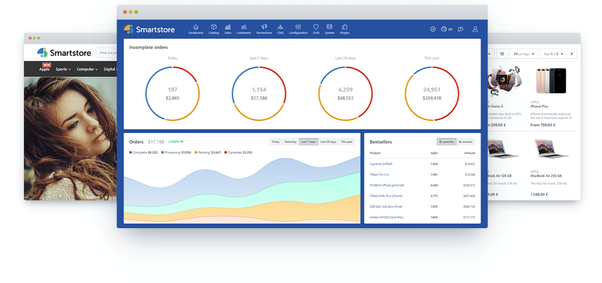

	

<h3 align="center">
	
</h3>
<h3 align="center"><strong>Ready. Sell. Grow.</strong></h3>

    A modular, scalable and ultra-fast open-source all-in-one eCommerce platform built on ASP.NET Core 6.

	<a href="#try-it-online">Try Online</a> ∙ 
	<a href="http://community.smartstore.com">Forum</a> ∙ 
	<a href="http://community.smartstore.com/marketplace">Marketplace</a> ∙ 
	<a href="http://translate.smartstore.com/">Translations</a>

 

  

Smartstore is a cross-platform, modular, scalable and ultra-fast open-source all-in-one eCommerce platform powered by ASP.NET Core 6, Entity Framework, Vue.js, Sass, Bootstrap and more. 

**Smartstore includes all essential features to create multilingual, multi-store and multi-currency shops** targeting desktop or mobile devices and enabling SEO optimized rich product catalogs with support for an unlimited number of products and categories, variants, bundles, datasheets, ESD, discounts, coupons and many more.

A comprehensive set of tools for CRM & CMS, sales, marketing, payment & shipping handling etc. makes Smartstore a powerful all-in-one solution fulfilling all your needs.

**Smartstore delivers a beautiful and configurable shop frontend out-of-the-box**, built with a design approach on the highest level, including components like `Sass`, `Bootstrap` and others. The supplied theme _Flex_ is modern, clean and fully responsive, giving buyers the best possible shopping experience on any device.

The state-of-the-art architecture of Smartstore - with `ASP.NET Core 6`, `Entity Framework Core 6` and Domain Driven Design approach - makes it easy to extend, extremely flexible and essentially fun to work with ;-)

* :house: **Website:** [http://www.smartstore.com/en/net](http://www.smartstore.com/en/net)
* :speech_balloon: **Forum:** [http://community.smartstore.com](http://community.smartstore.com)
* :mega: **Marketplace:** [http://community.smartstore.com/marketplace](http://community.smartstore.com/marketplace)
* :earth_americas: **Translations:** [http://translate.smartstore.com/](http://translate.smartstore.com/)
* :blue_book: **Documentation:** [Smartstore Documentation in English](https://smartstore.atlassian.net/wiki/spaces/SMNET50/pages/1956118583/Getting+Started)

&nbsp;

## Technology & Design

* State of the art architecture thanks to `ASP.NET Core 6`, `Entity Framework Core 6` and Domain Driven Design
* Cross-platform: run it on Windows, Linux, or Mac
* Supports `Docker` out of the box for easy deployment
* Composable, easy to extend and extremely flexible thanks to modular design
* Highly scalable thanks to full page caching and web farm support 
* A powerful theming engine lets you create or customize themes & skins with minimum effort thanks to theme inheritance
* Point&Click theme configuration
* Liquid template engine: very flexible templating for e-mails and campaigns with autocompletion and syntax highlighting
* Html to PDF converter: PDF documents are created from regular HTML templates, therefore radically simplifying PDF output customization
* Consistent and sophisticated use of modern components such as `Vue.js`, `Sass`, `Bootstrap` & more in the front and back end.
* Easy shop management thanks to modern and clean UI

&nbsp;

## Key Features

  

* Multi-Store support
* Multi-language and comprehensive RTL (Right-to-left) and bidi(rectional) support
* Multi-currency support
* Product Bundles, Variants, Attributes, ESD, Tier Prices, Cross Selling and many more
* Sophisticated Marketing & Promotion capabilities (Gift Cards, Reward Points, Discounts of any type and more)
* Reviews & Ratings
* Media Manager: powerful and lightning-fast explorer for media files
* Rule Builder: powerful rule system for visual business rule creation with dozens of predefined rules out-of-the-box
* Search framework with faceted search support. Ultra fast search results, even with millions of items!
* Extremely scalable thanks to output caching, REDIS & Microsoft Azure support
* Tree-based permission management (ACL) with inheritance support
* Sophisticated import/export framework (profiles, filters, mapping, projections, scheduling, deployment... just everything!)
* CMS Page Builder: create fascinating content that will boost your sales. No coding is required thanks to a powerful WYSIWYG editor which utilizes the revolutionary CSS Grid system
* Blog, Forum, Polls, custom pages & HTML content etc.
* CMS Menu Builder: visual manager for all sorts of menus. Change existing menus or create your own and place them anywhere you want
* Modern, clean, SEO-optimized and fully responsive theme based on `Bootstrap`
* Support for hierarchical SEO slugs, e.g.: *samsung/galaxy/s22/32gb/white*
* *Trusted Shops* precertification and full compliance with EU-GDPR requirements
* 100% compliant with German jurisdiction
* Sales-, Customer- & Inventory-management
* Comprehensive CRM features
* Powerful layered navigation in the shop
* Numerous Payment and Shipping providers and options
* Wallet: enables full or partial order payment via credit account
* TinyImage: scores ultra-high image compression rates (up to 80 %!) and enables WebP support
* Preview Mode: virtually test themes and stores more easily
* RESTful WebApi (coming soon)
* and many more...

&nbsp;

## Getting Started

### System requirements

* Windows 10 (or higher) / Windows Server 2012 R2 (or higher)
* Ubuntu 14.04+
* Debian 11+
* Mac OS X 10.11+
* MS SQL Server 2008 Express (or higher), MySQL

### Upgrade from Smartstore.NET 4.2

Smartstore 5 is a port of [Smartstore.NET 4](https://github.com/smartstore/SmartStoreNET) - which is built on classic .NET Framework 4.7.2 – to the new `ASP.NET Core 6` platform. Smartstore instances based on classic `ASP.NET MVC` can be upgraded seamlessly. To [perform the upgrade](https://smartstore.atlassian.net/wiki/spaces/SMNET50/pages/1956118609/Updating+from+Previous+Versions), only the app files need to be replaced on your server - except for the `App_Data` directory - and **all data will be automatically transferred to the new system**. [Check the docs for detailed information about installing or upgrading your shop](https://smartstore.atlassian.net/wiki/spaces/SMNET50/pages/1956118822/Installing+Smartstore).

 :information_source: Upgrading from versions older than 4.2 is not possible. Therefore, you should first migrate Smartstore.NET to version 4.2 and then upgrade to Smartstore 5.

### Visual Studio

- Clone the repository using the command `git clone https://github.com/smartstore/Smartstore.git` and checkout the `main` branch.
- Download Visual Studio 2022 (any edition) from https://www.visualstudio.com/downloads/
- Open `Smartstore.sln` and wait for Visual Studio to restore all NuGet packages
- Ensure `Smartstore.Web` is the startup project and run it

### Repository Structure

- [`Smartstore`](https://github.com/smartstore/Smartstore/tree/main/src/Smartstore) contains common low-level application-agnostic stuff like bootstrapper, modularity engine, caching, pub/sub, imaging, type conversion, IO, templating, scheduling, various utilities, common extension methods etc.
- [`Smartstore.Data`](https://github.com/smartstore/Smartstore/tree/main/src/Smartstore.Data) contains database providers
- [`Smartstore.Core`](https://github.com/smartstore/Smartstore/tree/main/src/Smartstore.Core) contains application specific modules like catalog, checkout, identity, security, localization, logging, messaging, rules engine, search engine, theme engine, migrations etc.
- [`Smartstore.Web.Common`](https://github.com/smartstore/Smartstore/tree/main/src/Smartstore.Web.Common) contains common web features like custom MVC infrastructure, bundling, TagHelpers, HtmlHelpers etc.
- [`Smartstore.Modules`](https://github.com/smartstore/Smartstore/tree/main/src/Smartstore.Modules) contains all module/plugin projects
- [`Smartstore.Web`](https://github.com/smartstore/Smartstore/tree/main/src/Smartstore.Web) is the entry host project that contains controllers, model classes, themes, static assets etc.

&nbsp;

## Build Smartstore

### Option 1 - by publishing the entry host project

1. Open the Smartstore solution in Visual Studio 2022
2. Use **Release** configuration
3. (Re)build the solution
4. Publish host project **Smartstore.Web**

### Option 2 - by running a build script

Run the build script corresponding to your target platform in the directory **build**: `build.{Platform}.cmd`. The result build will be placed in the directory `build/artifacts/Community.{Version}.{Platform}`. Also, a zip archive is created automatically in **build/artifacts/**.

By default, the build script produces a platform-dependent, self-contained application that includes the ASP.NET runtime and libraries, the Smartstore application and its dependencies. You can run it on any machine that doesn't have the .NET runtime installed.

Smartstore uses Nuke (https://nuke.build/) as build automation solution, which makes it easy to customize the build process by editing the file `src/Smartstore.Build/Smartstore.Build/Build.cs`.

### Info about "src/Smartstore.Web/Modules" directory

While building the solution, all modules in `src/Smartstore.Modules/` are discovered, compiled and placed in the `src/Smartstore.Web/Modules/` directory. The application runtime uses this directory as a source from which modules are dynamically
loaded from. However, during development, the "Modules" directory is irrelevant. You can safely delete it at any time.

### Creating Docker images

To create a Docker image run `build/dockerize.{Platform}[.nobuild].sh`.

##### dockerize.linux.sh

Creates a Debian Linux base image including the complete ASP.NET runtime, builds the solution and publishes a framework-dependent application within the Linux container. Also installs **wkhtmltopdf** native library which is required to generate PDF files.

##### dockerize.linux.nobuild.sh

Much faster, but requires that the application was previously built and is located in `build/artifacts/Community.{Version}.linux-x64`. Creates a Debian Linux base image including the ASP.NET runtime dependencies only and copies the build artifact. Also installs **wkhtmltopdf** native library which is required to generate PDF files.

##### dockerize.windows.nobuild.sh

Creates a Windows Nano Server base image including the ASP.NET runtime dependencies only and copies the build artifact. Requires that the application was previously built and is located in `build/artifacts/Community.{Version}.win-x64`. Also requires that the Docker engine is running a Windows image.

### Creating Docker containers

To create a ready-to-run Docker container including a database server run `compose.{DbSystem}.sh`. 

##### compose.mysql.sh

Creates a composite Docker container containing the **smartstore** application image and the latest **MySql** image.

##### compose.sqlserver.sh

Creates a composite Docker container containing the **smartstore** application image and the latest **MS SQL Server** image.

&nbsp;

## Try it online

We have set up a live online demo for you so you are able to test Smartstore without local installation. Get a first impression and test all available features in the front- and in the backend. Please keep in mind that the backend demo is shared and other testers can modify data at the same time.

* [**Frontend**](https://core.smartstore.com/frontend/en) (User: demo, PWD: 1234)
* [**Backend**](https://core.smartstore.com/backend/admin/) (User: demo, PWD: 1234)

&nbsp;

## License

Smartstore Community Edition is released under the [AGPL license](https://www.gnu.org/licenses/agpl-3.0.de.html).

**Give our new repository a star** to stay up-to-date, get involved or just watch how we're doing. Learn all about the latest development, participate actively and last but not least, don't miss new releases.
