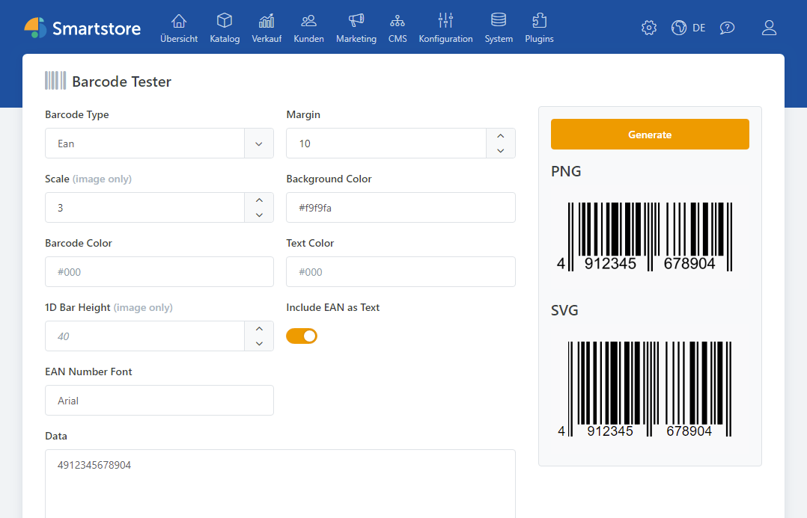

# QR codes

Smartstore ships with a lightweight barcode subsystem capable of producing QR codes or many other barcode formats. Encoding is performed by `IBarcodeEncoder` which turns a `BarcodePayload` into an `IBarcode` that can render SVG or raster images.

## Supported barcode types

The encoder understands multiple symbologies:

* `QRCode` – used for bank transfers and generic 2D codes
* `EAN`
* `UPC-A`
* `UPC-E`
* `Aztec`
* `Codabar`
* `Code128`
* `Code39`
* `Code93`
* `DataMatrix`
* `KixCode`
* `PDF417`
* `RoyalMail`
* `TwoToFive`

You can try each format in the admin barcode tester at `/admin/barcodetester/`.

<figure><figcaption></figcaption></figure>

## Encoding data

Inject `IBarcodeEncoder` and pass a payload describing the data you want to encode. For simple scenarios you can use `BarcodePayload` with `BarcodeType.Qr`:

```csharp
public class QrDemo
{
    private readonly IBarcodeEncoder _encoder;
    public QrDemo(IBarcodeEncoder encoder)
    {
        _encoder = encoder;
    }

    public async Task<string> GenerateAsync()
    {
        var payload = new BarcodePayload("https://example.com", BarcodeType.Qr);
        var code = _encoder.EncodeBarcode(payload);

        // SVG string
        var svg = code.GenerateSvg(new BarcodeSvgOptions { Margin = 2 });

        // Raster image
        using var img = code.GenerateImage(new BarcodeImageOptions { Scale = 5 });
        await img.SaveAsync("wwwroot/qr.png");

        return svg;
    }
}
```

`GenerateSvg` returns the XML of the QR drawing. `GenerateImage` produces an `IImage` that can be saved in any supported format.

## Structured payloads

The abstract `QrPayload` class lets you create strongly typed payloads for complex scenarios (Wi‑Fi credentials, calendar events, …):

```csharp
class WiFiPayload : QrPayload
{
    public WiFiPayload(string ssid, string password)
    {
        Ssid = ssid;
        Password = password;
    }

    public string Ssid { get; }
    public string Password { get; }

    public override string Serialize()
        => $"WIFI:T:WPA;S:{Ssid};P:{Password};;";
}

var payload = new WiFiPayload("ShopWifi", "secret");
var code = _encoder.EncodeBarcode(payload);
```

## Rendering options

Both SVG and image generation accept option classes for coloring and sizing:

```csharp
var svg = code.GenerateSvg(new BarcodeSvgOptions
{
    BackColor = "#fff",
    ForeColor = "#222",
    Margin = 4
});

using var img = code.GenerateImage(new BarcodeImageOptions
{
    BackColor = Color.White,
    ForeColor = Color.Black,
    Scale = 4
});
```

Margins are specified in pixels. Image rendering also exposes a `Scale` factor and bar height for 1D barcodes, although these are ignored for QR codes.

QR codes are generated through the same imaging pipeline as product pictures, so cached results end up in the media cache and can be served efficiently.
