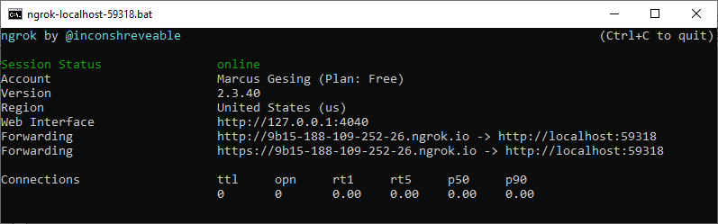

# ✔️ Payment

## Overview

A payment provider represents a payment method with which an order can be paid in the frontend. Furthermore, it contains other optional methods, e.g. capturing the payment amount later, when the goods are shipped or to perform a refund. It is recommended to learn about the general functioning of a [provider](../platform/modularity-and-providers.md#providers) before going on.

If no SDK is provided for a payment gateway or you do not want to use it for whatever reason, it is recommended to write your own HTTP client to communicate with the gateway. See the [PayPal HTTP client](https://github.com/smartstore/Smartstore/blob/main/src/Smartstore.Modules/Smartstore.PayPal/Client/PayPalHttpClient.cs) as an example.

## Payment provider

The payment provider contains all the important functions for a specific payment method. A module can contain any number of payment providers and therefore any number of payment methods.


It is recommended to implement the payment methods of a payment company (like PayPal) in one module, not in many. In other words, the module should represent a certain payment company or gateway.


To create a payment provider add a class that inherits from `PaymentMethodBase` and optionally implements `IConfigurable`.


```csharp
[SystemName("MyCompany.MyCreditCardPayment")]
[FriendlyName("My credit card payment")]
[Order(1)]
public class MyCreditCardProvider : PaymentMethodBase, IConfigurable
{
    private readonly ICheckoutStateAccessor _checkoutStateAccessor;
    
    public MyCreditCardProvider(ICheckoutStateAccessor checkoutStateAccessor)
    {
        _checkoutStateAccessor = checkoutStateAccessor;
    }
    
    public RouteInfo GetConfigurationRoute()
        => new(nameof(MyPaymentAdminController.Configure), "MyPaymentAdmin", new { area = "Admin" });

    public override Widget GetPaymentInfoWidget()
        => new ComponentWidget(typeof(MyCreditCardInfoViewComponent));

    public override Task<ProcessPaymentResult> ProcessPaymentAsync(ProcessPaymentRequest processPaymentRequest)
    {
        var state = _checkoutStateAccessor.CheckoutState.GetCustomState<MyCustomCheckoutState>();

        // TODO: HTTP client that authorizes the payment against the payment gateway.
        // Uses "state" to temporarily save the result. Throws an exception on any failure.
        _ = await _httpClient.Authorize(state, processPaymentRequest.StoreId);

        return new ProcessPaymentResult
        {
            NewPaymentStatus = PaymentStatus.Authorized,
            AuthorizationTransactionId = state.Decision.TransactionId,
            AuthorizationTransactionCode = state.Id
        };
    }
}
```


For details about `SystemName` etc. see [providers](../platform/modularity-and-providers.md#providers). There are several properties and methods that the provider should override.

### Properties of PaymentMethodBase

<table><thead><tr><th width="233">Property</th><th>Description</th></tr></thead><tbody><tr><td><strong>IsActive</strong></td><td>A value indicating whether the payment method is active and should be offered to customers. Typically used for license checks. See <a href="creating-a-payment-provider.md#payment-method-filter">payment method filter</a>.</td></tr><tr><td><strong>PaymentMethodType</strong></td><td>See the <a href="creating-a-payment-provider.md#payment-method-types">table</a> below for available values. Choose a type that suits your payment method best.</td></tr><tr><td><strong>RequiresInteraction</strong></td><td>A value indicating whether the payment method requires user input in checkout before proceeding, e.g. credit card or direct debit payment.</td></tr><tr><td><strong>SupportCapture</strong></td><td>A value indicating whether capturing the payment amount later is supported, for instance when the goods are shipped. If <code>true</code>, you must override the <code>CaptureAsync</code> method.</td></tr><tr><td><strong>SupportPartiallyRefund</strong></td><td>A value indicating whether a partial refund is supported.  If <code>true</code>, you must override the <code>RefundAsync</code> method.</td></tr><tr><td><strong>SupportRefund</strong></td><td>A value indicating whether a full refund is supported. If <code>true</code>, you must override the <code>RefundAsync</code> method.</td></tr><tr><td><strong>SupportVoid</strong></td><td>A value indicating whether cancellation of the payment (transaction) is supported. If <code>true</code>, you must override the <code>VoidAsync</code> method.</td></tr><tr><td><strong>RecurringPaymentType</strong></td><td><p>The type of recurring payment. Available values are:</p><ul><li><em>NotSupported</em>: Recurring payment is not supported.</li><li><em>Manual</em>: Recurring payment is completed manually by the admin.</li><li>A<em>utomatic</em>: Recurring payment is processed on the payment gateway site.</li></ul></td></tr></tbody></table>

### Methods of PaymentMethodBase

<table><thead><tr><th width="320">Method</th><th>Description</th></tr></thead><tbody><tr><td><strong>GetPaymentInfoWidget</strong></td><td>Gets the widget metadata for the payment information. The payment information is displayed on the checkout's payment page. Return <code>null</code> when there is nothing to render.</td></tr><tr><td><strong>GetPaymentFeeInfoAsync</strong></td><td>Gets the additional handling fee for a payment.</td></tr><tr><td><strong>GetPaymentInfoAsync</strong></td><td>Gets a <code>ProcessPaymentRequest</code>. Called after the customer selected a payment method on the checkout's payment page. Typically used to specify a <code>ProcessPaymentRequest.OrderGuid</code> that can be sent to the payment provider before the order is placed. It is saved when the order is created.</td></tr><tr><td><strong>ValidatePaymentDataAsync</strong></td><td>Validates the payment data entered by the customer on the checkout's payment page.</td></tr><tr><td><strong>GetPaymentSummaryAsync</strong></td><td>Gets a short summary of payment data entered by the customer in checkout that is displayed on the checkout's confirm page. Typically used to display the brand name and a masked credit card number.</td></tr><tr><td><strong>PreProcessPaymentAsync</strong></td><td>Pre-process a payment. Called immediately before <code>ProcessPaymentAsync</code>. Can be used to complete required data such as the billing address.</td></tr><tr><td><strong>ProcessPaymentAsync</strong></td><td>Process a payment. Intended for main payment processing like payment authorization.</td></tr><tr><td><strong>PostProcessPaymentAsync</strong></td><td>Post-process a payment. Called after an order has been placed or when customer re-starts the payment (if supported). Can be used to redirect to a payment page to complete the payment <strong>AFTER</strong> the order has been placed.</td></tr><tr><td><strong>CanRePostProcessPaymentAsync</strong></td><td>Gets a value indicating whether customers can complete a payment after the order has been placed but not yet completed (only for redirection payment methods).</td></tr><tr><td><strong>CaptureAsync</strong></td><td>Captures a payment amount.</td></tr><tr><td><strong>RefundAsync</strong></td><td>Fully or partially refunds a payment amount.</td></tr><tr><td><strong>VoidAsync</strong></td><td>Cancels a payment (transaction).</td></tr><tr><td><strong>ProcessRecurringPaymentAsync</strong></td><td>Processes a recurring payment.</td></tr><tr><td><strong>CancelRecurringPaymentAsync</strong></td><td>Cancels a recurring payment.</td></tr></tbody></table>

## Payment method filter

Payment methods can be filtered using [IPaymentMethodFilter](https://github.com/smartstore/Smartstore/blob/main/src/Smartstore.Core/Checkout/Payment/Service/IPaymentMethodFilter.cs). Such an implementation can be useful when a payment method should only be offered if a certain shopping cart amount is exceeded.


```csharp
public partial class MyCustomPaymentFilter : IPaymentMethodFilter
{
    // Check provider acceptance once a day.
    const int CheckAcceptanceHours = 24;

    private readonly Lazy<MyPaymentProviderHttpClient> _httpClient;
    private readonly Lazy<IOrderCalculationService> _orderCalculationService;
    private readonly Lazy<ISettingFactory> _settingFactory;
    private readonly ILogger _logger;

    public MyCustomPaymentFilter(
        Lazy<MyPaymentProviderHttpClient> httpClient,
        Lazy<IOrderCalculationService> orderCalculationService,
        Lazy<ISettingFactory> settingFactory,
        ILogger logger)
    {
        _httpClient = httpClient;
        _orderCalculationService = orderCalculationService;
        _settingFactory = settingFactory;
        _logger = logger;
    }

    public async Task<bool> IsExcludedAsync(PaymentFilterRequest request)
    {
        try
        {
            if (request.PaymentMethod.Metadata.SystemName.EqualsNoCase("Payments.MyCustomPurchaseByInstallment"))
            {
                var settings = await _settingFactory.Value.LoadSettingsAsync<MyPaymentSettings>(request.StoreId);
                if (!settings.HasCredentials() || !settings.IsAcceptedByPaymentProvider)
                {
                    return true;
                }

                if (request.Cart != null)
                {
                    Money? cartTotal = await _orderCalculationService.Value.GetShoppingCartTotalAsync(request.Cart);
                    if (cartTotal == null || cartTotal.Value <= decimal.Zero || cartTotal.Value < settings.FinancingMin || cartTotal.Value > settings.FinancingMax)
                    {
                        // Cart total is not financeable.
                        return true;
                    }
                }

                if ((DateTime.UtcNow - settings.LastAcceptanceCheckedOn).TotalHours > CheckAcceptanceHours)
                {
                    try
                    {
                        await _httpClient.Value.UpdateAcceptedByPaymentProviderAsync(settings, request.StoreId);
                        if (!settings.IsAcceptedByPaymentProvider)
                        {
                            // Payment provider does not accept any further payment.
                            return true;
                        }
                    }
                    catch (Exception ex)
                    {
                        _logger.Error(ex);
                    }
                }
            }
        }
        catch (Exception ex)
        {
            _logger.Error(ex);
        }

        return false
    }
}
```


## Custom checkout state

In most cases, session-based data must be stored during checkout in order to communicate with the payment provider's API. This includes the ID of the payment transaction or session. Use the `CheckoutState` property of [ICheckoutStateAccessor](https://github.com/smartstore/Smartstore/blob/main/src/Smartstore.Core/Checkout/Orders/Services/ICheckoutStateAccessor.cs) to store any custom session data during checkout. Your state object must inherit from `ObservableObject`.


```csharp
[Serializable]
public class MyCustomCheckoutState : ObservableObject
{
    /// <summary>
    /// Technical transaction ID used in URLs for communication between 
    /// the module and API.
    /// </summary>
    public string Id
    {
        get => GetProperty<string>();
        set => SetProperty(value);
    }

    public string TransactionDataHash
    {
        get => GetProperty<string>();
        set => SetProperty(value);
    }

    public MyPaymentDecision Decision
    {
        get => GetProperty<MyPaymentDecision>();
        set => SetProperty(value);
    }
}
```


The `ObservableObject` allows changes to the state object to be applied to the session automatically. So, no `ISession.TrySetObject` or similar method needs to be executed.

```csharp
public override Task<ProcessPaymentRequest> GetPaymentInfoAsync(IFormCollection form)
{
    var state = _checkoutStateAccessor.CheckoutState.GetCustomState<MyCustomCheckoutState>();
    var (id, hash) = await CreateTransaction();
    state.Id = id;
    state.TransactionDataHash = hash;

    return new ProcessPaymentRequest
    {
        OrderGuid = Guid.NewGuid()
    };
}

private Task<(string ID, string DataHash)> CreateTransaction()
{
    // TODO: create a transaction using API and get back its ID.
    var id = "1.de.4145.1-0303135329-211";
    var hash = "1c05aa56405c447e6678b7f312";
    return Task.FromResult((id, hash));
}
```


The checkout state has a limited scope by design, starting with the shopping cart page and ending when the order is created. On the checkout completed page, for example, the checkout state no longer exists. If you want to keep data longer, you must either store it in the database or put it in a separate session object.


## Storing additional order data

The payment module provides current payment data via result objects, such as `ProcessPaymentResult`. They are stored by the core directly on the related order entity. Their most important properties are listed in the following table.

<table><thead><tr><th width="304">Property</th><th>Description</th></tr></thead><tbody><tr><td><strong>AuthorizationTransactionId</strong></td><td>The ID of a payment authorization. Usually this comes from a payment gateway.</td></tr><tr><td><strong>AuthorizationTransactionCode</strong></td><td>A payment transaction code. Not used by Smartstore. This can be any data that the payment provider needs for later processing.</td></tr><tr><td><strong>AuthorizationTransactionResult</strong></td><td>Short result information about the payment authorization.</td></tr><tr><td><strong>CaptureTransactionId</strong></td><td>The ID of a payment capture. Usually this comes from a payment gateway. Can be equal to <code>AuthorizationTransactionId</code>.</td></tr><tr><td><strong>CaptureTransactionResult</strong></td><td>Short result information about the payment capture.</td></tr><tr><td><strong>SubscriptionTransactionId</strong></td><td>The ID for payment subscription. Usually used for recurring payment.</td></tr></tbody></table>

Except for `AuthorizationTransactionCode` and `SubscriptionTransactionId`, this information is displayed on the order page in the admin backend, but they are not processed any further or used in any other way by Smartstore.

If more payment data needs to be stored in the database for an order, this should be done using the `GenericAttribute` entity. Suppose you have a provider for installment payments. Then the following code saves the interest and the order total including interest for a certain order.

```csharp
[Serializable]
public class MyPaymentOrderData
{
    [JsonIgnore]
    public static string Key => "MyCompany.MyModule.OrderAttribute";

    public decimal Interest { get; set; }
    public decimal TotalInclInterest { get; set; }
}

public override async Task PostProcessPaymentAsync(
    PostProcessPaymentRequest postProcessPaymentRequest)
{
    Order order = postProcessPaymentRequest.Order;    
    // TODO: get "decision" from somewhere, e.g. custom checkout state.
    string json = JsonConvert.SerializeObject(new MyPaymentOrderData
    {
        Interest = decision.Interest,
        TotalInclInterest = decision.TotalInclInterest
    });
    
    order.GenericAttributes.Set(MyPaymentOrderData.Key, json, order.StoreId);
    await order.GenericAttributes.SaveChangesAsync();    
}
```

## Webhooks and IPNs

Webhooks and IPNs (Instant Payment Notification) are HTTP-based callback functions the payment provider uses to send payment related messages to a shop, e.g. a payment status change. It is a kind of cross web application event system. Typically the message handler updates the [payment status](creating-a-payment-provider.md#payment-status) of an order according to the message. See the `AmazonPayController.IPNHandler` as an example of an IPN handler.


In case of misuse, these messages do not originate from the payment provider. The transmitted data should not be processed or stored directly. Instead, another call to the API of the payment provider is required to verify the authenticity. The handler then processes the data returned from the API. Some providers also provide the IP addresses from which their IPNs originate, which can be used for additional verification.


### WebhookEndpoint attribute

Each action method that receives and processes webhooks or IPNs must be decorated with the `WebhookEndpointAttribute`. It's a marker filter with the purpose to suppress customer resolution for such endpoints. The attribute prevents unnecessary creation of guest customers (as long as HTTP callbacks do not send any cookies). Instead, a system account with the system name `WebhookClient` is used.

### Testing webhooks and IPNs

We recommend using the [ngrok](https://ngrok.com/) service to test webhooks and IPNs. The service allows you to receive webhook messages and IPNs over an HTTP or HTTPS tunnel locally on localhost. It comes with a Windows console application named `ngrok.exe` that you need to download. The messages then reach your local shop through this tunnel, as long as the `ngrok.exe` is running and the tunnel is alive. The advantage of this service is the simple attachment to your development environment. You don't have to change or switch anything on your existing system like firewall, host, SSL, DDNS etc.


It will be even easier if you run `ngrok.exe` via a simple batch script which already contains your localhost URL.



```actionscript
%SystemRoot%\system32\cmd /C "C:\Tools\ngrok\ngrok.exe http 59318 -host-header="localhost:59318""
pause
```


<figure><figcaption><p>Active ngrok HTTP tunnel making a local shop accessible at localhost:59318.</p></figcaption></figure>

**Forwarding** shows the two URLs you can use to receive messages. You can enter them in the backend of the payment provider, together with the path to the action method that receives and processes payment messages. If the payment provider does not provide a setting for this and the URL must be supplied by code, you can also add a setting for the ngrok URL in the configuration of your payment method. Although this should only be visible in developer mode.

## Logging and order notes

Much of what a payment module does is done in the background. It is important to store information about it and about the respective payment process to easily track it.

It is recommended to add order notes for each communication with the payment gateway that causes any data update (including webhook messages and IPNs). This allows the merchant to track which and when data has been exchanged with the payment provider. Set `HasNewPaymentNotification` of the order entity to `true` if you receive a webhook message or IPN. A small info badge appears in the order list of the administration backend indicating that a new IPN has been received for this order.

Also log all errors (in detail) that occurred while exchanging data with the payment gateway. This information makes it easier for the payment provider's support to determine the cause of a payment problem.

## Appendix

### Payment method types

<table><thead><tr><th width="260">Payment method type</th><th>Description</th></tr></thead><tbody><tr><td><strong>Unknown</strong></td><td>Type is unknown.</td></tr><tr><td><strong>Standard</strong></td><td>All payment information is entered on the payment selection page.</td></tr><tr><td><strong>Redirection</strong></td><td>A customer is redirected to a third-party site to complete the payment <strong>AFTER</strong> the order has been placed. This type of processing is required for older payment types.</td></tr><tr><td><strong>Button</strong></td><td>Payment via button on the cart page.</td></tr><tr><td><strong>StandardAndButton</strong></td><td>All payment information is entered on the payment selection page and is available via button on the cart page.</td></tr><tr><td><strong>StandardAndRedirection</strong></td><td>Payment information is entered on checkout and the customer is redirected to complete the payment (e.g. 3D Secure) after the order has been placed.</td></tr></tbody></table>

### Payment status

The payment status is important because it is used to control processes for orders. For example, the button for later capturing of the payment amount is displayed only, if the payment (transaction) has been authorized (payment status `Authorized`).

<table><thead><tr><th width="225"></th><th></th></tr></thead><tbody><tr><td><strong>Pending</strong></td><td>The initial payment status if no further status information is available yet.</td></tr><tr><td><strong>Authorized</strong></td><td>The payment has been authorized (but not captured) by the payment provider. Usually this means that the payment amount is reserved for later capturing.</td></tr><tr><td><strong>Paid</strong></td><td>The payment has been captured against the payment gateway. It does not necessarily mean that the paid amount has been credited to the merchant's account.</td></tr><tr><td><strong>PartiallyRefunded</strong></td><td>The paid amount has been partially refunded.</td></tr><tr><td><strong>Refunded</strong></td><td>The paid amount has been fully refunded.</td></tr><tr><td><strong>Voided</strong></td><td>The payment has been cancelled.</td></tr></tbody></table>

Therefore, one task a payment provider has is setting the payment status to `Authorized` or `Paid` according to the payment gateway's feedback. Usually this is done in `ProcessPaymentAsync` or an action method for webhooks or IPNs.
