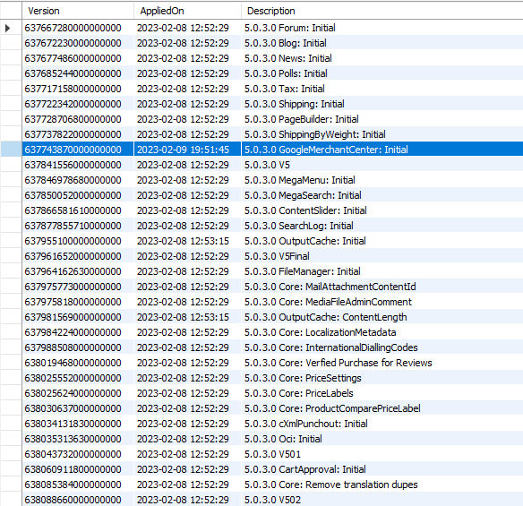

# ✔ Database Migrations

## Overview

Migrations are a structured way to alter a database schema and are required when changes need to be made to Smartstore's database tables or when new tables need to be added. Migrations can be found in the Smartstore core or in a module, depending on who created the related entity.

Smartstore uses [Fluent Migrator](https://fluentmigrator.github.io/) as a database migrations framework. Fluent Migrator supports many database systems such as SQL Server, MySQL or PostgreSQL, where migrations are described in C# classes that can be checked into the Fluent Migrator version control system.

Fluent Migrator can also write data to the database or update existing data, but this is more convenient using [IDataSeeder](https://github.com/smartstore/Smartstore/blob/main/src/Smartstore/Data/Migrations/IDataSeeder.cs) or its abstract implementation [DataSeeder](https://github.com/smartstore/Smartstore/blob/main/src/Smartstore.Core/Data/Migrations/DataSeeder%60T.cs).


Smartstore prefers Fluent Migrator over EF Core Migrations, because EF Migrations does not support database provider agnostic tooling and schema definition.


## Database Migrator

[DbMigrator](https://github.com/smartstore/Smartstore/blob/main/src/Smartstore.Core/Data/Migrations/DbMigrator%60T.cs) is responsible for performing migrations. `MigrateAsync` is used to migrate the database to a specified version, or to the latest, if none is specified.


`MigrateAsync` has an assembly parameter to perform only those migrations of a specific module. This should always be set. If it is `null`, the migrations of _all_ modules are executed!


The `MigrateAsync` below downgrades all migrations of a certain module. It allows to remove all changes made by the module to the database schema.

```csharp
internal class Module : ModuleBase
{
    private readonly DbMigrator<SmartDbContext> _dbMigrator;

    public Module(DbMigrator<SmartDbContext> dbMigrator)
    {
        _dbMigrator = dbMigrator;
    }

    public override async Task UninstallAsync()
    {
        await _dbMigrator.MigrateAsync(-1, GetType().Assembly);
        await base.UninstallAsync();
    }
}
```

## What does a migration look like?

A migration is an internal class inherited from the Fluent Migrator's abstract `Migration` class. The migration files should be named using the pattern `YYYYMMDDHHMMSS_<migration name>.cs`, so that they are ordered by date in ascending order.

The migration class must be decorated with the [MigrationVersionAttribute](https://github.com/smartstore/Smartstore/blob/main/src/Smartstore.Core/Data/Migrations/MigrationVersionAttribute.cs) to specify a version and a short description. The version is determined by a timestamp, that typically represents the date when the migration was created. The timestamp can have one of the following formats:

* yyyy-MM-dd HH:mm:ss (recommended)
* yyyy/MM/dd HH:mm:ss
* yyyy.MM.dd HH:mm:ss

To make the short description more uniform, we recommend the format `<module name>:<migration name>`, e.g. _Core: ProductComparePriceLabel_. The very first migration is usually named _Initial_, e.g. _MegaSearch: Initial_. A good example of a typical migration is [ProductComparePriceLabel](https://github.com/smartstore/Smartstore/blob/main/src/Smartstore.Core/Migrations/20221103091500\_ProductComparePriceLabel.cs).


```csharp
[MigrationVersion("2022-11-03 09:15:00", "Core: ProductComparePriceLabel")]
internal class ProductComparePriceLabel : Migration, ILocaleResourcesProvider, IDataSeeder<SmartDbContext>
{
    // Implementing 'ILocaleResourcesProvider' or 'IDataSeeder<T>' is optional here
    
    public DataSeederStage Stage => DataSeederStage.Early;
    public bool AbortOnFailure => false;
    
    public override void Up()
    {
        // Code omitted for clarity.
    }
    
    public override void Down()
    {
        // Code omitted for clarity.
    }
    
    public async Task SeedAsync(SmartDbContext context, CancellationToken cancelToken = default)
    {
        await context.MigrateLocaleResourcesAsync(MigrateLocaleResources);
    }

    public void MigrateLocaleResources(LocaleResourcesBuilder builder)
    {
        // Code omitted for clarity.
    }
}
```


<table><thead><tr><th width="352">Method or property</th><th>Description</th></tr></thead><tbody><tr><td><code>IMigration.Up</code></td><td>Collects the <em>up</em> migration expressions.</td></tr><tr><td><code>IMigration.Down</code></td><td>Collects the <em>down</em> migration expressions.</td></tr><tr><td><code>IDataSeeder.Stage</code></td><td>Gets a value that indicates the stage at which migration seeding is performed. Possible values are <code>Early</code> and <code>Late</code>.</td></tr><tr><td><code>IDataSeeder.AbortOnFailure</code></td><td>Gets a value indicating whether the migration should be completely rolled back if an error occurs during migration seeding.</td></tr><tr><td><code>IDataSeeder.SeedAsync</code></td><td>Seeds any data in the database.</td></tr><tr><td><code>ILocaleResourcesProvider.</code><br><code>MigrateLocaleResources</code></td><td>Seeds new or updated locale resources after a migration has been performed.</td></tr></tbody></table>

More examples can be found in the [DevTools](https://github.com/smartstore/Smartstore/tree/main/src/Smartstore.Modules/Smartstore.DevTools/Migrations) module. They are for illustrative purposes only and are therefore commented out so that they are not executed.


In the `ProductComparePriceLabel` migration, each statement is preceded by an existence check of the related resource (for a table, column, foreign key, field index, etc.). This is not mandatory but it is recommended. It makes your migration less vulnerable and ensures that in case of unpredictable events, the migration will still execute correctly, regardless of how many times it is executed. If your migration was only partially executed due to an error, it will not be able to run successfully again without these existence checks, and manual changes to of the database schema would be required.


In most cases, modules create migrations to extend the [domain model](../../compose/modules/examples/creating-a-domain-entity.md), i.e. to add their own entities. For example, the [Google Merchant Center](https://github.com/smartstore/Smartstore/tree/main/src/Smartstore.Modules/Smartstore.Google.MerchantCenter) module adds the `GoogleProduct` entity to the domain model and allows it to be edited via a data grid and a tab on the product editing page.

A migration can also inherit from `AutoReversingMigration`. In this case, no `Down` method is necessary, because FluentMigrator generates the necessary expressions automatically from the expressions of the `Up` method. This only works for some expressions like `CREATE TABLE`, but not for `DROP TABLE`.


Deleting a table added by the `Up` method should be well planned. The user may have stored a lot of data in it, which should not be deleted without asking. If in doubt, simply leave a table in the database when uninstalling the module. Often the `Down` method of the initial migration is left empty for this reason.


## Migrations history

Fluent Migrator keeps a version history of successfully executed migrations in the _\_\_MigrationVersionInfo_ database table. The contents of this table could look like this:

<figure><figcaption><p>Contents of the __MigrationVersionInfo table.</p></figcaption></figure>

By deleting an entry in this history, it is possible to run the associated migration, the next time you start the application. For example, if I want to run the inital migration of the Google Merchant Center module again, I delete the row for that migration (see the highlighted row in the image above). I also delete the `GoogleProduct` table because it is created by this migration. Without deleting the table, the migration would be executed but do nothing because `GoogleProduct` already exists, or generate an error if it didn't first check if the table already existed.


Manual modifications to the database schema should only be done with great care and sufficient knowledge of Smartstore. They may cause the software to stop working correctly and may require restoring a database from a backup.


## Data seeding

Data seeding allows you to add data to the database or to update existing data. If this is done in conjunction with a migration, you usually implement `IDataSeeder<SmartDbContext>` directly via its migration class, as shown earlier. Without a migration, or if larger amounts of data need to be transferred to the database, you use a separate class that inherits from `DataSeeder<SmartDbContext>`. For example, if you need to add sample data to the database during the installation of Smartstore or a module.

```csharp
internal class MyInstallationDataSeeder : DataSeeder<SmartDbContext>
{
    private readonly ModuleInstallationContext _installContext;
    // Indicates whether German data is seeded.
    private readonly bool _deSeedData;
    
    public MyInstallationDataSeeder(ModuleInstallationContext installContext)
        : base(installContext.ApplicationContext, installContext.Logger)
    {
        _installContext = Guard.NotNull(installContext, nameof(installContext));
        _deSeedData = _installContext.Culture?.StartsWith("de", StringComparison.OrdinalIgnoreCase) ?? false;
    }
    
    protected override async Task SeedCoreAsync()
    {
        await PopulateAsync(nameof(PopulateDataOfEntity1), PopulateDataOfEntity1);
        await PopulateAsync(nameof(PopulateDataOfEntity2), PopulateDataOfEntity2);
        
        if (_installContext.SeedSampleData == null || _installContext.SeedSampleData == true)
        {
            // TODO: populate only if Smartstore or this module is installed.
        }
    }
    
    private async Task PopulateDataOfEntity1()
    {
        var mySet = Context.Set<MyEntity1>();
        if (!await mySet.AnyAsync(/* condition */))
        {
            mySet.Add(new MyEntity1 { /*...*/ });
            await Context.SaveChangesAsync();        
        }
    }
    
    private async Task PopulateDataOfEntity2()
    {
        // TODO: populate Entity2.
    }    
}
```

Finally integrate your data seeder into the module installation.

```csharp
internal class Module : ModuleBase
{
    public override async Task InstallAsync(ModuleInstallationContext context)
    {
        await TrySeedData(context);
        await base.InstallAsync(context);
    }
    
    private async Task TrySeedData(ModuleInstallationContext context)
    {
        try
        {
            var seeder = new MyInstallationDataSeeder(context);
            await seeder.SeedAsync(Services.DbContext);
        }
        catch (Exception ex)
        {
            context.Logger.Error(ex, "MyInstallationSampleDataSeeder failed.");
        }
    }
}
```

### When is seeding performed?

Previously, migration seeding was always performed at application startup. This caused long-running seeders to fail after a timeout, resulting in the entire application startup being aborted.

The `IDataSeeder.Stage` property allows the developer to decide when to perform seeding.

* `Early`: Runs during application startup and is limited by timeout restrictions.
* `Late`: Runs after the application starts, but before the first request. There are no timeout restrictions because we have reached the middleware phase.


Structural migration is independent of this setting and is always performed at startup.


### Error handling

The `AbortOnFailure` property of `IDataSeeder` can be used to control the behavior on unhandled exceptions. It behaves differently depending on the selected `Stage` setting.

* `Early`: A rollback of the corresponding database migration is performed. The error is logged and the next seeder is executed.
* `Late`: No rollback is performed. An error is thrown and no more seeders are executed.

You should consider whether or not you can tolerate a failed seed. Depending on the application, it may not cause any problems, just a minor inconvenience.

### ModuleInstallationContext

The data seeder obtains `ModuleInstallationContext` via its constructor. It contains context information about the installation process of the application or the module and has the following properties:

<table><thead><tr><th width="248">Property</th><th>Description</th></tr></thead><tbody><tr><td><code>ApplicationContext</code></td><td>The application context.</td></tr><tr><td><code>Scope</code></td><td>The request scoped container from which to resolve services.</td></tr><tr><td><code>ModuleDescriptor</code></td><td>The descriptor of the module currently being installed.</td></tr><tr><td><code>SeedSampleData</code></td><td>A value indicating whether sample data should be seeded. During application installation, this reflects the choice made by the user in the installation wizard. During module installation, the value is always <code>null</code>; in this case, the module author should decide whether to seed sample data or not.</td></tr><tr><td><code>Culture</code></td><td>ISO code of the primary installation language. Usually only data representing this language is seeded.</td></tr><tr><td><code>Stage</code></td><td><p>Installation stage. Possible values are</p><ul><li><em>AppInstallation</em>: application is in installation stage.</li><li><em>ModuleInstallation</em>: application is installed and bootstrapped. The module should be installed by user request.</li></ul></td></tr><tr><td><code>Logger</code></td><td>Logger to use.</td></tr></tbody></table>

The [database migrator](database-migrations.md#database-migrator) publishes a `SeedingDbMigrationEvent` before each `IDataSeeder.SeedAsync` call and a `SeededDbMigrationEvent` after it.

### Seeding tools

There are some tools available for frequently recurring migration tasks. Use `SmartDbContext.MigrateLocaleResourcesAsync` in your `SeedAsync` method to add, update or delete locale string resources. The action delegate provides a `LocaleResourcesBuilder` with following methods:

<table><thead><tr><th width="170">Method</th><th>Description</th></tr></thead><tbody><tr><td><code>AddOrUpdate</code></td><td>Adds or updates a locale resource.</td></tr><tr><td><code>Update</code></td><td>Updates an existing locale resource.</td></tr><tr><td><code>Delete</code></td><td>Deletes one or many locale resources in any language.</td></tr><tr><td><code>DeleteFor</code></td><td>Deletes one or many locale resources in the specified language.</td></tr></tbody></table>

Use `SmartDbContext.MigrateSettingsAsync` to add or delete settings. The action delegate provides a `SettingsBuilder` with the following methods:

<table><thead><tr><th width="173">Method</th><th>Description</th></tr></thead><tbody><tr><td><code>Add</code></td><td>Adds a setting if it doesn't exist yet.</td></tr><tr><td><code>Delete</code></td><td>Deletes one or many setting records.</td></tr><tr><td><code>DeleteGroup</code></td><td>Deletes all setting records prefixed with the specified group name (usually the settings class name).</td></tr></tbody></table>


Use the `TypeHelper` to build the name of a setting:


```csharp
public async Task SeedAsync(SmartDbContext context, CancellationToken cancelToken = default)
{
    await context.MigrateSettingsAsync(builder =>
    {
        builder.Add(TypeHelper.NameOf<PerformanceSettings>(x => x.UseResponseCompression, true), "False");
    });
}
```

### SmartDbContextDataSeeder

`SmartDbContextDataSeeder` is a special data seeder that Smartstore uses to collect seeding instructions until the next version is released, mostly used to add or update locale string resources. Immediately before a new version is released, these are moved to a new migration that finalizes the version. This is done to avoid having to create new migrations for small changes and to limit the number of migrations.

## Appendix

### Migration examples

Add a column with index and foreign key if it does not exist yet:

```csharp
if (!Schema.Table(nameof(Product)).Column(nameof(Product.ComparePriceLabelId)).Exists())
{
    Create.Column(nameof(Product.ComparePriceLabelId)).OnTable(nameof(Product)).AsInt32().Nullable()
        .Indexed("IX_Product_ComparePriceLabelId")
        .ForeignKey("FK_Product_PriceLabel_ComparePriceLabelId", nameof(PriceLabel), nameof(BaseEntity.Id))
        .OnDelete(Rule.SetNull);
}
```

Reverse the above migration:

```csharp
if (products.Index("IX_Product_ComparePriceLabelId").Exists())
{
    Delete.Index("IX_Product_ComparePriceLabelId").OnTable(nameof(Product));
}

if (products.Constraint("FK_Product_PriceLabel_ComparePriceLabelId").Exists())
{
    Delete.ForeignKey("FK_Product_PriceLabel_ComparePriceLabelId").OnTable(nameof(Product));
}

if (products.Column(nameof(Product.ComparePriceLabelId)).Exists())
{
    Delete.Column(nameof(Product.ComparePriceLabelId)).FromTable(nameof(Product));
}
```

Add a column for date and time with a UTC default value:

```csharp
if (!Schema.Table(nameof(LocalizedProperty)).Column(nameof(LocalizedProperty.CreatedOnUtc)).Exists())
{
    Create.Column(nameof(LocalizedProperty.CreatedOnUtc)).OnTable(nameof(LocalizedProperty)).AsDateTime2().NotNullable().WithDefaultValue(SystemMethods.CurrentUTCDateTime);
}
```

Create a compound index:

```csharp
Create.Index("IX_ForumId_Published")
    .OnTable("Forums_Topic")
    .OnColumn("ForumId").Ascending()
    .OnColumn("Published").Ascending()
    .WithOptions()
    .NonClustered();
```

Create a foreign key:

```csharp
Create.ForeignKey()
    .FromTable("ForumPostVote").ForeignColumn(nameof(BaseEntity.Id))
    .ToTable(nameof(CustomerContent)).PrimaryColumn(nameof(BaseEntity.Id));
```
