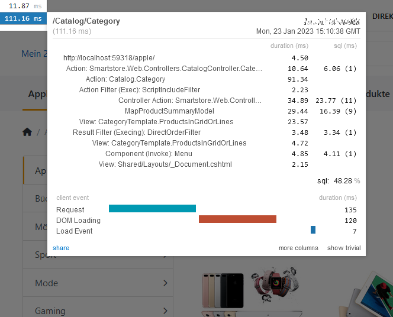

# ✔ Profiling

## Overview

Speed is important for every website. If a website takes a long time to load, it can have a negative impact on user experience, site traffic, and SEO. Sites that are optimized for performance have big advantages over slow sites. This is why it is important to _speed test_ your store before you launch it.

Smartstore includes a tool to measure the time from the initial request to the first byte sent to the browser ([Time to First Byte](https://en.wikipedia.org/wiki/Time\_to\_first\_byte) or **TTFB**): _MiniProfiler_.

## MiniProfiler

MiniProfiler is a library and user interface for profiling your application. By letting you see where your time is spent, what queries are running, and any other custom timings you want to add, MiniProfiler helps you debug problems and optimize performance.

The default setup of MiniProfiler is to display a widget in the top left corner of every page. This keeps performance in the forefront of your mind.

<figure><figcaption></figcaption></figure>

### Activating MiniProfiler

The MiniProfiler is part of the _Developer Tools_ module, which is installed and enabled by default.

To activate profiling and display the widget, go to **Plugins / Developer Tools** in the admin area and check the **Enable MiniProfiler** checkbox. Only users with **Administrator role** can see the profiler widget.


For more info about the MiniProfiler library, see [https://miniprofiler.com/dotnet/](https://miniprofiler.com/dotnet/)


### Exclude paths from profiling

By default, the profiler ignores the following path prefixes:

1. **/admin/**
2. **/bundle/**
3. **/css/**
4. **/images/**
5. **/js/**
6. **/media/**
7. **/taskscheduler/**
8. **/themes/**

To customize this ignore list, simply edit **MiniProfiler ignored paths** and separate each entry with a comma. You can profile backend pages by removing the **/admin/** entry and saving the setting.

## Custom timings

The profiler widget displays timings for:

* controller actions
* filters
* view resolution & rendering
* view component execution
* database queries
* app specific but important metrics

To hook into profiling use the `IChronometer` service to find out how much time a custom code block took to execute.

* The `StepStart` method starts a new timer with a key and a message to display in the widget
* `StepStop` stops the timer
* The `Step` extension method makes usage even easier because it follows the disposable pattern (the disposer calls `StepStop` implicitly)

If the **Developer Tools** module is installed and the MiniProfiler is active, the profiler widget will display your custom timing with the given message. If the **Developer Tools** module is not installed, `NullChronometer` takes over.

<pre class="language-csharp" data-title="Custom timing example"><code class="lang-csharp"><strong>using (_chronometer.Step("Some expensive code"))
</strong>{
    // ... execute some expensive code
}
</code></pre>
