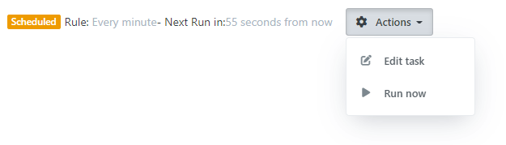

# ✔ Scheduling

## Overview

Smartstore has a scheduling module that allows automated tasks, such as cleaning files, sending emails, and importing or exporting data, to be executed at specific times. Scheduling is particularly useful for handling long-running or resource-intensive tasks. The scheduling system uses a timer to check for overdue tasks every minute and runs them as part of an HTTP request, helping to ensure that the dependency scope is always up and running.

Unless otherwise specified, the task context virtualizer ([ITaskContextVirtualizer](https://github.com/smartstore/Smartstore/blob/main/src/Smartstore/Scheduling/Services/ITaskContextVirtualizer.cs) interface) virtualizes some environment parameters during task execution:

* `IWorkContext.CurrentCustomer` for the BackgroundTask system customer
* `IStoreContext.CurrentStore` for the primary (first) store

## Task descriptor

The [TaskDescriptor](https://github.com/smartstore/Smartstore/blob/main/src/Smartstore/Scheduling/Domain/TaskDescriptor.cs) domain entity defines metadata for tasks, including the task name, [cron expression](https://crontab.cronhub.io/), enabled status, priority, and task type to run. Some of these values, such as the cron expression and enabled status, can be edited by the user in the backend.&#x20;

The cron expression determines the next time a task will run, and after a task has run, a history entry is created with information about the execution time, duration, machine name, and any errors that may have occurred.&#x20;

Users also have the option to manually trigger a task in the backend, and any running task can be manually cancelled in the backend as well.

## Implementing a task

To implement a task, create a concrete class that implements the [ITask](https://github.com/smartstore/Smartstore/blob/main/src/Smartstore/Scheduling/Services/ITask.cs) interface. It does not need to be registered in the DI, but is automatically detected and registered as a _scoped service_ when the application starts. This allows task types to have dependencies.

The `Run` method is the task handler. There is **no synchronous** counterpart! The task executor calls this method asynchronously and waits for it to complete.

If an exception occurs during task execution (either unhandled or thrown explicitly), the task execution stops and the error is logged. If the `StopOnError` property of the task descriptor is set to `true`, the task is disabled and will not be executed again unless the user re-enables it.

By default, the name of the task type (without namespace) is `TaskDescriptor.Type`. You can decorate your class with the [TaskNameAttribute](https://github.com/smartstore/Smartstore/blob/main/src/Smartstore/Scheduling/Services/TaskNameAttribute.cs) to specify a different name for the task, which can be useful to avoid potential name conflicts with other tasks.


If the task resolver detects that there is more than one overdue task during a single poll, these tasks are executed **one after the other**, rather than in parallel. If a task has not completed execution by the time the next poll occurs (one minute later), the task executor will skip it.



Because the scheduling system checks for overdue tasks on a minute-by-minute basis, it is not useful to define a cron expression with a frequency less than a minute, such as "every 30 seconds."


The following is an example of how to implement a task. The [DeleteGuestsTask](https://github.com/smartstore/Smartstore/blob/main/src/Smartstore.Core/Platform/Identity/Tasks/DeleteGuestsTask.cs) task periodically deletes guest customers. It implements the `ITask` interface, which contains the `Run` method. The method accepts the `TaskExecutionContext` and the `CancellationToken` (see below) as parameters. In this example, the task retrieves the last date guest customers were required to be registered, and then calls the `DeleteGuestCustomersAsync` method.

```csharp
public class DeleteGuestsTask : ITask
{
    private readonly ICustomerService _customerService;
    private readonly CommonSettings _commonSettings;

    public DeleteGuestsTask(
        ICustomerService customerService, 
        CommonSettings commonSettings)
    {
        _customerService = customerService;
        _commonSettings = commonSettings;
    }

    public async Task Run(TaskExecutionContext ctx, CancellationToken cancelToken = default)
    { 
        var registrationTo = DateTime.UtcNow.AddMinutes(
            -_commonSettings.MaxGuestsRegistrationAgeInMinutes);

        await _customerService.DeleteGuestCustomersAsync(
            null, 
            registrationTo, 
            true, 
            cancelToken);
    }
}
```

## Task cancellation

It is important that tasks can be cancelled, particularly those that take a long time to complete. The `CancellationToken` parameter is used to allow cancellation via the user through the backend.&#x20;

The `CancellationToken` combines the application shutdown token and the user cancellation token, and periodically checks if cancellation has been requested to try to gracefully terminate the task. It is not necessary to check for this on every iteration, but it can be checked after completing a batch of work.

The following example shows the `Run` task in the [DataImportTask ](https://github.com/smartstore/Smartstore/blob/main/src/Smartstore.Core/Platform/DataExchange/Import/DataImportTask.cs)class, where the `CancellationToken` is passed to the `ImportAsync` method, which terminates the import after 100 processed entities.&#x20;

<pre class="language-csharp" data-overflow="wrap"><code class="lang-csharp">public async Task Run(
    TaskExecutionContext ctx, 
    CancellationToken cancelToken = default)
{
    var request = new DataImportRequest(ctx.ExecutionInfo.Task.Alias.ToInt())
    {
        ProgressCallback = OnProgress
    };

    // Process!
<strong>    await _importer.ImportAsync(request, cancelToken);
</strong>    Task OnProgress(int value, int max, string msg)
    {
        return ctx.SetProgressAsync(value, max, msg);
    }
}
</code></pre>

You can also throw an exception if the cancellation request was sent. The extension shows the `ImportAsync` method, which is part of the [DataImporter ](https://github.com/smartstore/Smartstore/blob/main/src/Smartstore.Core/Platform/DataExchange/Import/DataImporter.cs)class and is called by the `Run` task in the previous example. The code has been shortened to show the essentials.

<pre class="language-csharp" data-overflow="wrap"><code class="lang-csharp">public async Task ImportAsync(
    DataImportRequest request, 
    CancellationToken cancelToken = default)
{
    //...
    try
    {
        // Data import code
    }
    catch (Exception ex)
    {
        logger.ErrorsAll(ex);
    }
    finally
    {
        await Finalize(ctx);
    }

<strong>    cancelToken.ThrowIfCancellationRequested();
</strong>}
</code></pre>

## Propagating task progress

The Task Scheduler UI in the backend can display task progress (either as a message, as a percentage, or both).

To show the progress, you need to pass the [TaskExecutionContext](https://github.com/smartstore/Smartstore/blob/main/src/Smartstore/Scheduling/Services/TaskExecutionContext.cs) class as a parameter to the `Run` method, which contains the `SetProgress` method (with various overloads and sync/async variants). You can call it to propagate progress. It is immediately stored in the database. The UI then fetches updated progress information every second and can display it.

## Adding or removing tasks programmatically

Adding or removing tasks programmatically is required if your module provides tasks. Your tasks must be added to the task store during module installation and removed during uninstall.

Here is an example of how to add a task in the module's base class (called `Module`):


```csharp
internal class Module : ModuleBase
{
    private readonly ITaskStore _taskStore;

    public Module(ITaskStore taskStore)
    {
        _taskStore = taskStore;
    }

    public override async Task InstallAsync(ModuleInstallationContext context)
    {
        // Add the task if it does not exist yet.
        await _taskStore.GetOrAddTaskAsync<MyTaskImplType>(x =>
        {
            x.Name = "My localized task display name";
            x.CronExpression = "0 */1 * * *"; // every hour
            x.Enabled = true;
        });

        await base.InstallAsync(context);
    }

    public override async Task UninstallAsync()
    {
        // Try to remove the task. Do nothing if it does not exist.
        await _taskStore.TryDeleteTaskAsync<MyTaskImplType>();

        await base.UninstallAsync();
    }
}
```


## System tasks

If you want to hide a task from the user, `TaskDescriptor.IsHidden` must be set to `true`. This property cannot be edited by the user. A hidden task is not displayed in the task scheduler UI, but you can invoke the `MinimalTaskViewComponent` to show the state of a single task anywhere you want (see below). The component displays common task information in a very compact widget.

```csharp
@await Component.InvokeAsync("MinimalTask", new 
{ 
    // The TaskDescriptor entity id
    taskId = Model.TaskId, 
    // "false" hides the "Cancel" button for a running task
    cancellable = false
})
```

<figure><figcaption></figcaption></figure>

The image shows the component when the task has not yet been run. It provides buttons to edit and run the task immediately. If the task is currently running, a progress indicator is displayed and a cancel button is available (assuming the task is set to be cancellable).

## Executing single tasks programmatically

To run a single task programmatically, you can call the `ITaskScheduler.RunSingleTaskAsync()` method and provide the unique identifier of the task you want to run (`TaskDescriptor.Id`) as an argument. You can also pass optional parameters (dictionaries), which will be converted to a URL query string and can be accessed through the `TaskExecutionContext.Parameters` property. To virtualize the current customer during task execution, you can pass the **CurrentCustomerId** as a parameter. Virtualizing the current store needs the **CurrentStoreId** as parameter.

In the next example the `ApplyRules` method of the [CategoryController ](https://github.com/smartstore/Smartstore/blob/main/src/Smartstore.Web/Areas/Admin/Controllers/CategoryController.cs)executes a single task. The method receives the `TaskDescriptor.Id` as a parameter as well as additional data as dictionaries (in this case, `CategoryIds`).

```csharp
[HttpPost]
[Permission(Permissions.Catalog.Category.Update)]
public async Task<IActionResult> ApplyRules(int id)
{
    var category = await _db.Categories.FindByIdAsync(id, false);
    if (category == null)
    {
        return NotFound();
    }

    var task = await _taskStore.GetTaskByTypeAsync<ProductRuleEvaluatorTask>();
    if (task != null)
    {
        // Trigger execution, but do not await. This is ok, because under the hood
        // the scheduler delegates execution to the web scheduler via HttpClient.
        _ = _taskScheduler.RunSingleTaskAsync(task.Id, new Dictionary<string, string>
        {
            { "CategoryIds", category.Id.ToString() }
        });

        NotifyInfo(T("Admin.System.ScheduleTasks.RunNow.Progress"));
    }
    else
    {
        NotifyError(T("Admin.System.ScheduleTasks.TaskNotFound", nameof(ProductRuleEvaluatorTask)));
    }

    return RedirectToAction(nameof(Edit), new { id = category.Id });
}
```

## Task leasing

By default, tasks are run exclusively. This means that the task is locked during execution. So even in a web farm, only one server can execute a single task. The first server always wins. Other servers will skip an already running task. To change this behavior (so that each server in a web farm can run a task in parallel), set `TaskDescriptor.RunPerMachine` to `true`. This makes sense if your task does something that needs to be done on each server. E.g.: cleaning up local files, creating redundant / replicated indexes, etc.


The user cannot edit the `RunPerMachine` setting in the backend.


## Implementing a custom Task Store provider

To create a custom task store provider, you will need to create a class that implements the [ITaskStore](https://github.com/smartstore/Smartstore/blob/main/src/Smartstore/Scheduling/Services/ITaskStore.cs) interface. The default implementation stores task information and progress in the database. We cannot think of any scenario where it makes sense to override this 😊, but for the sake of completeness, the necessary steps are as follows:

* Create a class that implements the `ITaskStore` interface
* Follow the contract and implement all members
* Register your custom class in the `ConfigureContainer` method of your Startup class, which will overwrite the default registration. For example:

```csharp
internal class Startup : StarterBase
{
    public override void ConfigureContainer(
        ContainerBuilder builder, 
        IApplicationContext appContext)
    {
        builder.AddTaskScheduler<MyCustomTaskStore>(appContext);
    }
}
```

## Troubleshooting

To poll for overdue tasks, the scheduler must call an HTTP URL every minute through an `HttpClient` instance. On application start-up, the scheduler does its best to determine a base URL that works. It tests several host names in the following order:

* Request hostname
* localhost
* 127.0.0.1
* Machine's local IP address

Even then, it may sometimes happen that none of the tested hosts work due to environment issues. In this case, try specifying a custom base URL via _appsettings.json_. Look for the `TaskSchedulerBaseUrl` entry and set a valid and working URL, like **`http://www.mystore.com/`**. Also, don't forget to restart the application.


Inspect the application logs to check for any scheduler polling errors.

