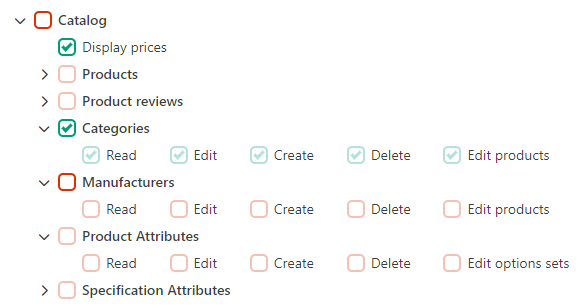

# ✔️ Security

## Overview

Web security is a very important topic for anyone who wants to keep their data safe. Smartstore offers ways to restrict access to data:

* An extensible, hierarchically organized permissions system, where permissions are assigned to customer roles, which are then assigned to customers.
* Customer roles (including assigned permissions) can automatically be assigned to customers by rule sets.
* [IAclRestricted](https://github.com/smartstore/Smartstore/blob/main/src/Smartstore.Core/Platform/Security/Domain/IAclRestricted.cs) marks an entity with restricted access rights. Only customers assigned to specific customer groups can see or access it.

Further security tools available are:

* Anti-forgery token
* Captcha
* Honeypot

## Permissions tree

Permissions are organized hierarchically in the form of a tree. A permission is granted when it has either granted itself or one of its parent permissions. The same applies to a permission that is explicitly not permitted. In this way, entire groups of permissions can be activated via a parent permission, where child permissions inherit from any ancestor. Therefore, a permission can have four statuses:

| Status             |                                                                                                                              Representation                                                                                                                             |
| ------------------ | :---------------------------------------------------------------------------------------------------------------------------------------------------------------------------------------------------------------------------------------------------------------------: |
| Allow              |                            |
| Disallow           |                      |
| Inherited allow    |    |
| Inherited disallow |  |

<div align="center"><figure><figcaption><p>Example of a permissions tree (partial view)</p></figcaption></figure></div>

## Authorization

Use the [IPermissionService](https://github.com/smartstore/Smartstore/blob/main/src/Smartstore.Core/Platform/Security/Services/IPermissionService.cs) to check whether a given permission is granted to a customer. It expects strings as the name of the permission to be checked. Several constants are provided through the `Permissions` class for this purpose.

```csharp
await _permissionService.AuthorizeAsync(Permissions.System.ScheduleTask.Execute);
```

Action methods use the `PermissionAttribute` instead of [IPermissionService](https://github.com/smartstore/Smartstore/blob/main/src/Smartstore.Core/Platform/Security/Services/IPermissionService.cs).

```csharp
[Permission(Permissions.Catalog.Product.Read)]
public async Task<IActionResult> Edit(int id)
{
    //...
}
```

Use the `NeverAuthorizeAttribute` when the access to the requested endpoint is always permitted. For instance, the action method of the login page is decorated with this attribute.

An `AccessDeniedException` is thrown when the permission is not granted. In case of an AJAX request, a message notification is shown, and an alert is returned if a HTML response is expected, or a JSON object otherwise.

## Add custom permissions

The permission system can be extended to include custom permissions using the [IPermissionProvider](https://github.com/smartstore/Smartstore/blob/main/src/Smartstore.Core/Platform/Security/Services/IPermissionProvider.cs). See the [DevToolsPermissionProvider](https://github.com/smartstore/Smartstore/blob/main/src/Smartstore.Modules/Smartstore.DevTools/Permissions.cs) example. It is recommended to use singular for permission names and define a root permission _Self_ that doesn't contain any dots by convention:


```csharp
public const string Self = "megasearch";
```


The localization is done via string resources and by convention. The string resource key is `Permissions.DisplayName.<PermissionName>` for the core and `Modules.Permissions.DisplayName.<PermissionName>` for modules. In most cases only the root permission _Self_ is localized because other permissions are already localized by the core like _read_, _update_, _execute_ etc. See `PermissionService._displayNameResourceKeys` for a complete list.


Module permissions are automatically added when the module is installed and removed when uninstalling the module. Module developers do not need to do anything else here.

**TIP:** For an [IMenuProvider](https://github.com/smartstore/Smartstore/blob/main/src/Smartstore.Core/Content/Menus/Services/MenuProviders/IMenuProvider.cs) such as the `AdminMenuProvider`, one or more permissions can be applied via `MenuItemBuilder.PermissionNames`. The related link in the admin menu is only displayed if the admin has been granted permission.


## Access control list (ACL)

An entity supports restricted access rights when it implements [IAclRestricted](https://github.com/smartstore/Smartstore/blob/main/src/Smartstore.Core/Platform/Security/Domain/IAclRestricted.cs). It allows limiting an entity to certain customer roles. Only customers who are assigned to one of the associated customer roles can see the product, the category, the menu item, etc.

Use [IAclService](https://github.com/smartstore/Smartstore/blob/main/src/Smartstore.Core/Platform/Security/Services/IAclService.cs) to check whether the customer has the right to access an entity. If you only want to load those entities from the database the customer has access to, use the `ApplyAclFilter` extension method.

Use `IAclService.ApplyAclMappingsAsync` when you want to modify the access rights of a customer to an entity. This is typically done when the entity is updated on its edit page.

## Protection tools

### Anti-Forgery token

To help prevent CSRF attacks, ASP.NET Core uses anti-forgery tokens, also called _request verification tokens_. Such a token is automatically created if the HTML form tag uses at least one _asp-\*_ attribute and the form is processed by the ASP.NET Core `TagHelper` accordingly.

```cshtml
<form asp-action="Configure">
```

In all other cases, `Html.AntiForgeryToken()` must be explicitly called inside the view for the token to be rendered.

Data grids also create the token automatically but only if the property _allowEdit_ or allowRowSelection is _true_. Only in these cases the data grid has its own HTML form:

```cshtml
<datagrid id="myentity-grid" allow-row-selection="true" allow-edit="true">
    @* ... *@
</datagrid>
```

Otherwise the `IgnoreAntiforgeryTokenAttribute` must be used on the server side to suppress the validation of the token and avoid errors due to a missing token.

For AJAX operations via _smartstore.ajax.js_ or jQuery the token is also generated automatically. Only if a HTML form is created from scratch, the token must be included as well:


```javascript
var form = '<form id="MyHtmlForm" action="' + $(this).data('url') + '" method="post">';
form += '<input type="hidden" name="__RequestVerificationToken" value="@Html.GetAntiforgeryToken()">';
form += '</form>';
$('body').append(form);
$('#MyHtmlForm').submit();
```



`Html.GetAntiforgeryToken()` renders the anti-forgery token server-side. `window.getAntiforgeryToken()` returns the token using JavaScript.


### Captcha

Decorate an action method with the `ValidateCaptchaAttribute` to prevent malicious software from accessing your endpoint. The attribute uses the widely used Google reCAPTCHA for protection. `CaptchaTagHelper` renders the Google widget in your view.

```cshtml
<captcha sm-enabled="Model.DisplayCaptcha" class="form-group" />
```

### Honeypot

"Honeypots" can be used to prevent robots from posting or manipulating HTML forms. The `ValidateHoneypotAttribute` redirects back to the current page if an HTML form has been modified by a bot. `HoneypotTagHelper` renders the required form element in your view.

```cshtml
<honeypot sm-enabled="true" />
```

### Others

In addition to those already mentioned, there are a few other attributes with similar access-restricting functions.

<table><thead><tr><th width="287">Filter attribute</th><th>Description</th></tr></thead><tbody><tr><td><code>AuthorizeAdmin</code> *</td><td>Checks whether the current user has the permission to access the administration backend.</td></tr><tr><td><code>AuthorizeShopAccess</code></td><td>Checks whether the current user has the permission to access the shop.</td></tr><tr><td><code>DisallowRobot</code></td><td>Disallows robots to access an endpoint.</td></tr><tr><td><code>RequireSsl</code></td><td>A marker filter indicating that the current request should be received over HTTPS (if the policies allow this).</td></tr><tr><td><code>ValidateAdminIpAddress</code> *</td><td>Validates the IP address of the user requesting access and match it against a list of allowed IP addresses.</td></tr></tbody></table>

\* if your controller inherits from `AdminController`, this attribute is automatically set and your controller is protected accordingly.
